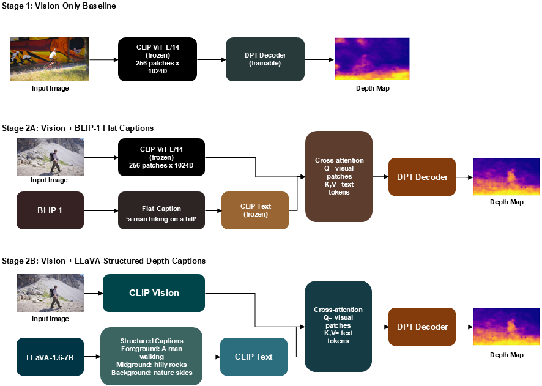
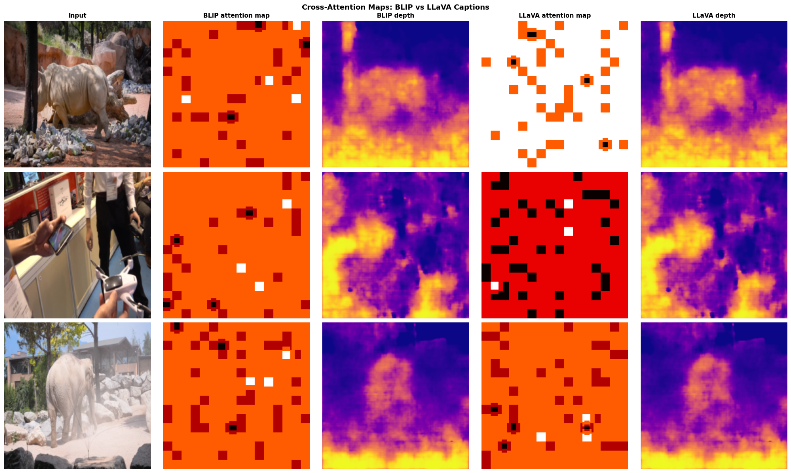
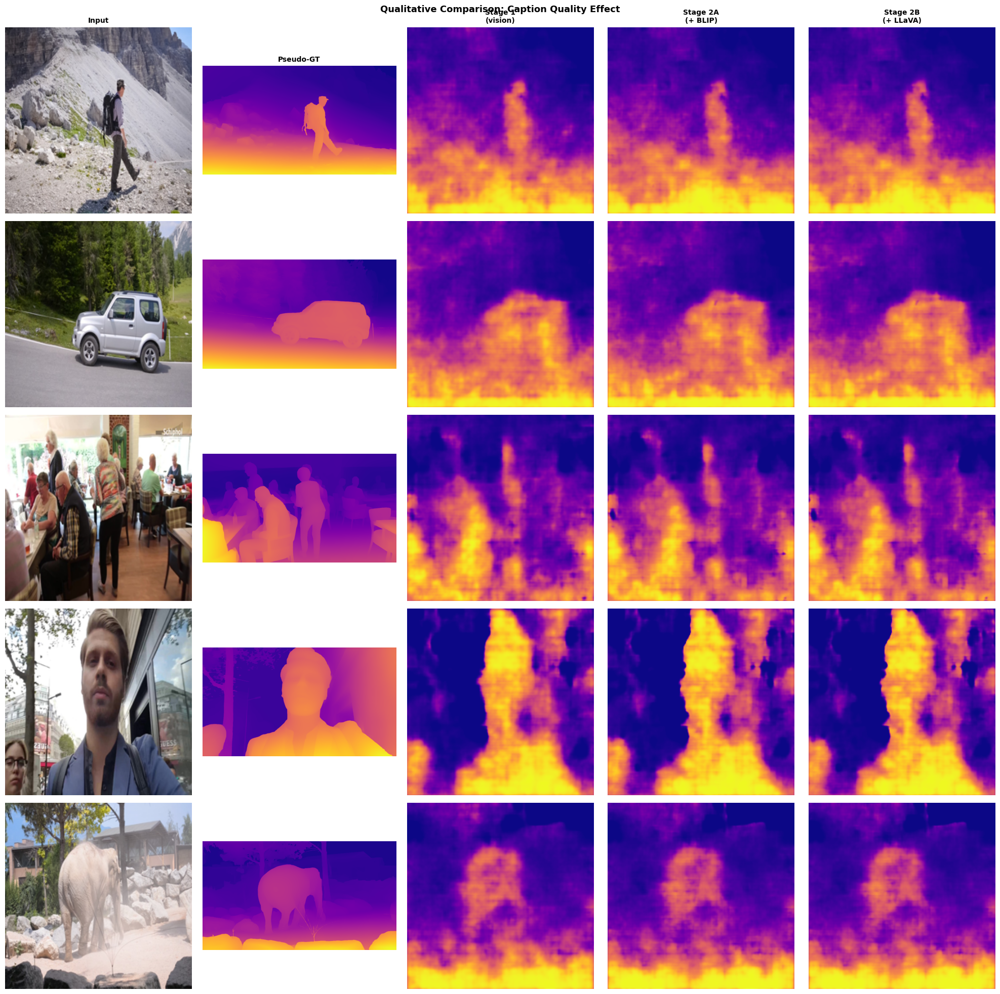
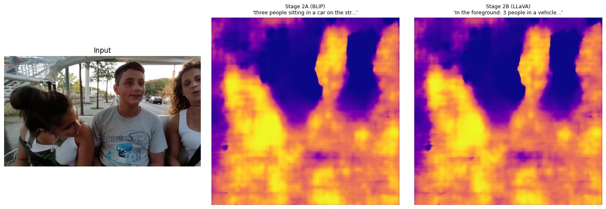

# Text-conditioned-depth-estimation-on-DAVIS
This is a GitHub repository of a project that looks into whether a vision model can be conditioned into understanding monocular depth in an image if it is supported with textual descriptions of the scene

## Abstract

Language conditioning has been proposed as a way to inject semantic and contextual information into monocular depth estimation networks, but reported gains are small and the role of caption *quality* is not well understood. We design a controlled comparison: a frozen CLIP ViT-L/14 vision backbone with a trainable DPT decoder, trained on the DAVIS 2017 video dataset with pseudo-depth labels from Depth Anything V2 Small, in three configurations that share architecture and hyperparameters and differ only in their caption source. **Stage 1** is vision-only (no captions). **Stage 2A** adds cross-attention conditioned on flat semantic captions from BLIP-1. **Stage 2B** uses identical cross-attention conditioned on **structured depth-ordered captions** generated by LLaVA-1.6-7B (4-bit) acting as a zero-shot depth structure annotator. We find both captioned variants improve over the vision-only baseline (δ1 = 0.5220 → 0.5434 for BLIP, → 0.5451 for LLaVA), and a controlled caption-content ablation reveals that LLaVA captions carry meaningfully more depth-relevant signal than BLIP: replacing real captions with empty strings drops Stage 2B's δ1 by 1.27 pp but only 0.29 pp for Stage 2A. This is direct evidence that *the kind of language used matters as much as whether language is used at all*.


---

## Motivation

Monocular depth estimation is fundamentally underdetermined: a single 2D image is consistent with infinitely many 3D scene configurations. Modern depth networks (MiDaS, Depth Anything V2) resolve this ambiguity by learning strong visual priors from large-scale data. However, humans routinely use semantic and contextual reasoning ("the building is far because it's behind the trees") to infer depth, and this kind of relational reasoning is not naturally captured by purely visual networks.

Recent vision-language models (VLMs) make it cheap to obtain rich textual descriptions of arbitrary images. This raises a sharp question:

> **Does the type of caption matter for language-conditioned depth estimation, or is it enough to add any caption at all?**

Prior work conditioning depth networks on free-form image captions has reported small or inconsistent improvements. We hypothesize that the bottleneck is not the addition of language *per se* but the *kind* of language used. A flat caption such as

> *"three people sitting in a car on the street"*

is rich semantically but contains no explicit depth information. In contrast, a structured description such as

```
FOREGROUND: 3 people in a vehicle
MIDGROUND:  cars on the street
BACKGROUND: trees, sky
DEPTH CUES: receding road perspective
```

embeds ordinal depth structure directly into the language signal. We treat a small VLM as a **zero-shot depth structure annotator** — its job is to organize objects by depth layer, not to write a fluent caption — and ask whether this structured signal is more useful than flat semantic content.

---

## Dataset

### DAVIS 2017

We use the [DAVIS 2017](https://davischallenge.org/) video object segmentation dataset (trainval split, 480p resolution). DAVIS contains 90 video sequences spanning a wide variety of scenes (sports, nature, urban, indoor) with consistent foreground objects and rich camera/object motion. The dataset is well-suited to depth research because it provides high-quality, high-resolution natural video; diverse scene compositions with clear depth structure; and consecutive frame pairs that enable temporal consistency objectives.

We sample keyframes at stride 5 and cap each sequence at 30 frames, yielding approximately 2,200 training images and 250 validation images after a 90/10 split. Consecutive frame pairs are also extracted for the temporal consistency loss term.

### Pseudo-depth Labels

DAVIS does not include depth annotations. Following recent practice in self-supervised and weakly-supervised depth estimation, we generate **pseudo-depth labels** using Depth Anything V2 Small as a teacher. Predicted depth maps are normalized via 5th–95th percentile clipping per image:

$$d_{\text{norm}} = \frac{\text{clip}(d, p_5, p_{95}) - p_5}{p_{95} - p_5}$$

This produces robust relative-depth targets in [0, 1] suitable for scale-invariant losses.

### Two Caption Sources

For each frame we generate **two** captions, one from each source. The pipeline is fully deterministic and resumable.

**BLIP-1 (control condition).** We use `Salesforce/blip-image-captioning-base` with beam search (3 beams, max 40 new tokens). BLIP produces flat, single-sentence semantic captions:

> *"a man riding a bicycle past a wall covered in graffiti"*
> *"three people sitting in a car on the street"*
> *"an elephant standing in front of a building"*

**LLaVA-1.6-7B (experimental condition).** We use `llava-hf/llava-v1.6-mistral-7b-hf` loaded at 4-bit NF4 quantization (≈5 GB VRAM, fits comfortably on an L4). The model is prompted with:

```text
[INST] <image>
Analyze this image for monocular depth estimation.
List objects grouped by depth layer. Use EXACTLY this format:

FOREGROUND (closest): <objects>
MIDGROUND: <objects>
BACKGROUND (farthest): <objects>
DEPTH CUES: <perspective/size/occlusion cues>
[/INST]
```

The structured output is parsed into a flat caption that preserves depth ordering in word order (used for the CLIP text encoder), a `depth_layers` dictionary, and a list of **ordinal pairs** `(closer_object, "closer", farther_object)` derived from the layer assignments. Example:

> Raw VLM output:
> ```
> FOREGROUND (closest): cyclist, bicycle
> MIDGROUND: graffiti wall, path
> BACKGROUND (farthest): trees, sky
> DEPTH CUES: perspective lines on path, size gradient of trees
> ```
>
> Parsed flat caption:
> *"In the foreground: cyclist, bicycle. in the middle: graffiti wall, path. in the background: trees, sky. perspective lines on path, size gradient of trees."*

These ordinal pairs serve as supervision for an auxiliary ordinal ranking loss in Stage 2B.

---

## Methods

### Architecture Overview



All three stages share the same frozen CLIP ViT-L/14 vision encoder (1024-d patch features, 16×16 patch grid at 224px input) and the same trainable DPT decoder that upsamples patch features to a full-resolution depth map. The stages differ in how (and whether) language is injected between these two components.

### Stage 1 — Vision-Only Baseline

The simplest configuration:

$$d = \text{DPT}(f_{\text{vision}}(I))$$

where $f_{\text{vision}}$ is the frozen CLIP vision encoder and DPT is a four-stage transposed-convolutional decoder. This stage establishes a strong vision-only reference point against which language conditioning is measured.

**Loss:** Scale-invariant log loss + gradient matching + edge-aware smoothness.

### Stage 2A — Cross-Attention with BLIP-1 Flat Captions (Control)

We extend Stage 1 with a single cross-attention block:

1. The BLIP-1 caption is tokenized and encoded by a frozen CLIP text encoder, yielding $T \in \mathbb{R}^{N \times 768}$.
2. Text features are linearly projected to the vision dimension: $T' = W_t T \in \mathbb{R}^{N \times 1024}$.
3. Visual patches attend to text tokens:
   $$f_{\text{fused}} = \text{LayerNorm}\left(f_{\text{vision}} + \text{CrossAttn}(Q=f_{\text{vision}}, K=T', V=T')\right)$$
4. The DPT decoder operates on $f_{\text{fused}}$.

**Loss:** Stage 1 losses + temporal consistency loss across consecutive frame pairs. The ordinal ranking loss term is present in the loss function but evaluates to zero for BLIP because BLIP captions don't supply ordinal pairs.

### Stage 2B — Cross-Attention with LLaVA Structured Captions (Experimental)

**Architecturally identical to Stage 2A.** The only differences are:

1. The caption fed to the CLIP text encoder is the LLaVA-generated structured caption (depth-ordered).
2. The ordinal ranking loss is now active because LLaVA supplies `(closer, farther)` pairs:

$$\mathcal{L}_{\text{rank}} = \frac{1}{|\mathcal{P}|}\sum_{(c,f) \in \mathcal{P}} \max(0,\, m - (\bar{d}^{\text{deep}} - \bar{d}^{\text{shallow}}))$$

This loss encourages the predicted depth distribution to be bimodal with at least margin $m = 0.1$ between near and far regions when ordinal pairs are present.

By keeping architecture and hyperparameters identical between 2A and 2B, any difference in performance can be attributed to the caption source alone.

## Results

### Quantitative Summary

| Stage | Configuration | δ1 ↑ | Δ vs Stage 1 |
|---|---|---|---|
| Stage 1 | Vision-only baseline | 0.5220 | — |
| Stage 2A | + BLIP-1 flat captions | 0.5434 | **+2.14 pp** |
| Stage 2B | + LLaVA structured captions | **0.5451** | **+2.31 pp** |

Both captioned configurations improve over the vision-only baseline. LLaVA structured captions yield a small but consistent additional gain over BLIP flat captions (+0.17 pp). However, the headline numbers alone do not tell the full story — the **caption-content ablation below** is what reveals whether each model is actually *using* its captions.

### Caption-Content Ablation

The key experiment of this study. For each Stage 2 model, we re-evaluate on validation with three caption-feeding regimes:

- **real:** the dataset's own captions (BLIP for 2A, LLaVA for 2B).
- **shuffled:** captions randomly permuted across the validation set, so each image gets a caption from a different image. Semantic content is preserved at the population level but is unrelated to any specific image.
- **empty:** all captions replaced with empty strings.

If a model is genuinely using caption content, performance should drop under shuffling and drop further under emptiness. If a model is treating the caption as a constant or noise input, all three should be similar.

| Variant | δ1 ↑ | Drop vs real |
|---|---|---|
| **Stage 2A (BLIP)** | | |
| 2A real captions | 0.5434 | — |
| 2A shuffled captions | 0.5408 | −0.26 pp |
| 2A empty captions | 0.5405 | −0.29 pp |
| **Stage 2B (LLaVA)** | | |
| 2B real captions | **0.5451** | — |
| 2B shuffled captions | 0.5430 | −0.21 pp |
| 2B empty captions | 0.5324 | **−1.27 pp** |

This is the most informative finding of the project. **Stage 2B drops 4.4× more (1.27 pp vs 0.29 pp) when its captions are removed**, while Stage 2A is largely indifferent to whether real captions, shuffled captions, or empty strings are provided. Two interpretations follow directly:

1. **Stage 2A is barely using BLIP's content.** The 2A model essentially treats the cross-attention pathway as added capacity rather than as an information channel. Whatever caption is provided, it learns to produce roughly the same depth.
2. **Stage 2B is genuinely using LLaVA's content.** Empty captions cost Stage 2B 1.27 pp δ1, while shuffled captions only cost 0.21 pp — meaning the model learned that *some* depth-structured caption helps, even an unrelated one, and a *correctly matched* depth caption helps a bit more on top.

### Cross-Attention Map Comparison

To further investigate where each model attends, we extract the cross-attention weights from the trained Stage 2A and Stage 2B models, sum across heads and over text tokens, and reshape the result into a 16×16 patch grid.



Three observations from the attention maps:

- **BLIP (2A) attention is sparse and largely unstructured.** Most patches fire near zero with a few hot pixels in seemingly arbitrary locations. Consistent with the ablation finding that the model isn't extracting much from BLIP's content.
- **LLaVA (2B) attention has noticeably more spatial structure**, particularly visible in the second row where the attention map shows a clear pattern of moderate activation across many patches rather than two or three isolated hot spots. The LLaVA model has learned to attend to text more broadly across the image.
- **The depth predictions look qualitatively similar** despite the different attention patterns, which is consistent with the small (+0.17 pp) δ1 gap between 2A and 2B at convergence.

### Qualitative Comparison



Visual comparison on five representative DAVIS validation frames. Columns left to right: input, pseudo-depth ground truth, Stage 1 prediction, Stage 2A (BLIP) prediction, Stage 2B (LLaVA) prediction. Differences between Stage 2A and 2B are visually subtle, consistent with the small δ1 gap at convergence. The gap between Stage 1 and the captioned stages is more visible — particularly on the hiker (row 1) and the car (row 2), where the captioned models produce sharper foreground/background separation.

### Single-Image Inference Example



A held-out validation frame (three people in a vehicle on a street) with both captions side-by-side:

- **BLIP**: *three people sitting in a car on the street*
- **LLaVA**: *In the foreground: 3 people in a vehicle, 2 girls and 1 boy. In the middle: 2 cars on the road, 1 red traffic light. in the background: Trees and buildings along the road. Perspective, size, and occlusion of objects*

Both produce plausible depth maps. The LLaVA output shows slightly tighter separation between the foreground figures and the receding street, but the difference is at the threshold of what's visually detectable.

---

## Discussion

### Headline Finding: Caption Quality Matters More Than Caption Presence

The cleanest result is the contrast between the headline numbers and the ablation:

- By δ1 alone, BLIP and LLaVA look similar (0.5434 vs 0.5451 — a 0.17 pp gap).
- The ablation reveals that these two models behave fundamentally differently. Removing real captions costs 2A only 0.29 pp but costs 2B 1.27 pp.

This means **Stage 2A's improvement over Stage 1 is largely architectural**, not informational. The cross-attention block adds ~10M parameters of additional capacity, and most of the +2.14 pp gain over Stage 1 comes from that capacity rather than from BLIP's content. Stage 2B uses the same capacity but additionally extracts real signal from its captions: about 1.0 pp of its +2.31 pp gain over Stage 1 comes from caption content.

This reframes the contribution of language conditioning for depth: small VLMs are useful as **depth structure annotators**, not as generic captioners.

### Why BLIP Captions Don't Help

Two factors plausibly explain why BLIP-1 captions provide essentially no caption-specific signal:

1. **No depth structure.** BLIP captions are flat: *"a man riding a bike past a wall."* They identify what's in the scene, but not how the things in the scene are arranged in depth. CLIP text features for "man" and "wall" carry no information about which is closer to the camera.
2. **Population-level redundancy.** When captions for different DAVIS frames are interchangeable in their effect on depth predictions (real ≈ shuffled, as we observe), the model has learned a constant or near-constant text representation that any caption induces. The optimizer found a degenerate solution that satisfies the loss without leveraging caption-specific content.

### Why LLaVA Captions Help

LLaVA's structured outputs have three properties that BLIP's flat outputs lack:

1. **Explicit ordinal scaffolding.** The FOREGROUND/MIDGROUND/BACKGROUND structure carries ordinal information directly in word order. CLIP text embeddings of *"In the foreground: cyclist"* differ predictably from *"In the background: trees"* in a way that CLIP embeddings of *"a man rides a bike"* and *"trees"* do not.
2. **Geometric depth cues.** The "DEPTH CUES" line — *"perspective lines on path, size gradient of trees"* — names the very visual cues a depth network needs to learn to use. This pseudo-supervision likely steers the cross-attention to attend to perspective-relevant regions.
3. **Ordinal pair supervision.** LLaVA's parsed `(closer, farther)` pairs feed into the ranking loss, providing a direct training signal that BLIP cannot provide.

The 1.27 pp drop when LLaVA captions are removed is direct evidence that all three signals together carry depth-relevant content the model exploits.

### Limitations

- **Pseudo-labels not real depth.** All metrics are computed against Depth Anything V2 Small predictions, which are themselves imperfect. Absolute δ1 values are not directly comparable to the literature on NYU-v2 or KITTI.
- **Single dataset.** DAVIS is small (~2,200 training images) compared to standard depth benchmarks. Generalization to other domains (indoor, autonomous driving) is untested.
- **Frozen backbones.** Both CLIP encoders are frozen. Joint fine-tuning could change the result but would require substantially more compute than a single L4 GPU provides.
- **Single VLM.** We use only LLaVA-1.6-7B. Different VLMs (Qwen-VL, InternVL, MoonDream) might produce structurally different captions and shift the gap. The experiment as designed isolates the *type* of caption, not the *specific VLM*.
- **Single captioning prompt.** We use one structured prompt. Variations (e.g., requesting absolute depth estimates, requesting bounding boxes) could produce a stronger or weaker signal.

### Future Work

The most natural next experiment is to evaluate on a standard depth benchmark such as **NYU-v2** zero-shot, allowing direct comparison to published language-conditioned depth methods. A second priority is to test whether the LLaVA gains transfer when the underlying vision backbone is replaced with something stronger (e.g., DINOv2 features or a Depth Anything V2 backbone with a small LoRA). A third priority is to investigate whether prompting LLaVA for explicit *quantitative* depth estimates (e.g., "give relative distances in arbitrary units") yields a stronger signal than the qualitative ordinal layering used here.

---

## References

1. **Ranftl, R., Bochkovskiy, A., & Koltun, V.** (2021). *Vision Transformers for Dense Prediction*. ICCV. (DPT decoder.)

2. **Yang, L., Kang, B., Huang, Z., Xu, X., Feng, J., & Zhao, H.** (2024). *Depth Anything V2*. NeurIPS.

3. **Liu, H., Li, C., Wu, Q., & Lee, Y. J.** (2023). *Visual Instruction Tuning*. NeurIPS. (LLaVA.)

4. **Li, J., Li, D., Xiong, C., & Hoi, S.** (2022). *BLIP: Bootstrapping Language-Image Pre-training for Unified Vision-Language Understanding and Generation*. ICML. (BLIP-1.)

5. **Radford, A., Kim, J. W., Hallacy, C., Ramesh, A., Goh, G., Agarwal, S., et al.** (2021). *Learning Transferable Visual Models From Natural Language Supervision*. ICML. (CLIP.)

6. **Pont-Tuset, J., Perazzi, F., Caelles, S., Arbeláez, P., Sorkine-Hornung, A., & Van Gool, L.** (2017). *The 2017 DAVIS Challenge on Video Object Segmentation*. arXiv:1704.00675.

7. **Eigen, D., Puhrsch, C., & Fergus, R.** (2014). *Depth Map Prediction from a Single Image using a Multi-Scale Deep Network*. NeurIPS. (Scale-invariant log loss.)

8. **Dettmers, T., Pagnoni, A., Holtzman, A., & Zettlemoyer, L.** (2023). *QLoRA: Efficient Finetuning of Quantized LLMs*. NeurIPS. (4-bit NF4 quantization for LLaVA.)

9. **Auty, D., & Mikolajczyk, K.** (2023). *Learning to Prompt CLIP for Monocular Depth Estimation*. ICCVW. (Prior work on language-conditioned depth.)

10. **Zeng, J., Tong, Y., Huang, Y., Yan, Q., Sun, W., Chen, J., & Wang, Y.** (2024). *WordDepth: Variational Language Prior for Monocular Depth Estimation*. CVPR.


